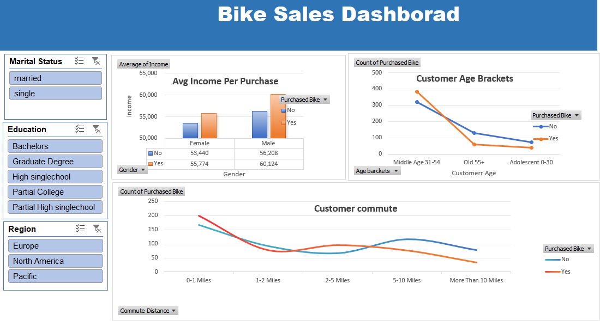

# Bike Sales Data Analysis Project 🚲

## 📊 Project Overview
This project focuses on analyzing customer demographics and purchasing behavior for a bike company. Using **Microsoft Excel**, I transformed raw data into a functional, interactive dashboard to help stakeholders understand which customer segments are most likely to purchase a bike.

## 🖼️ Dashboard Preview

*Figure 1: Final Interactive Dashboard with Slicers for Region, Education, and Occupation.*

---

## 🛠️ Data Processing Workflow

### 1. Data Cleaning & Preparation
To ensure the accuracy of the analysis, several cleaning steps were performed:
* **Duplicate Removal:** Identified and removed 26 duplicate entries.
* **Standardization:** Used 'Find and Replace' to change shorthand values (M/S, M/F) to full descriptive terms (**Married/Single**, **Male/Female**).
* **Data Formatting:** Adjusted currency and numeric columns for consistency.

### 2. Feature Engineering
Created a custom **Age Bracket** column using a nested `IF` formula to segment customers into meaningful life stages:
* **Adolescent:** Under 31
* **Middle Age:** 31 to 54
* **Old:** 55 and above

### 3. Pivot Tables
Multiple pivot tables were constructed on a dedicated sheet to calculate:
* **Average Income** per purchase status, categorized by gender.
* **Customer Count** based on commute distance.
* **Purchase Trends** across different age brackets.

---

## 📈 Key Insights
* **Target Demographic:** Middle-aged individuals (31-54) are the primary buyers.
* **Commute Correlation:** Potential customers with a commute of **0-1 miles** show the highest conversion rate.
* **Income Level:** There is a positive correlation between higher average income and the likelihood of purchasing a bike.

---

## 🚀 How to Interact with the Project
1. Clone this repository or download the `.xlsx` file.
2. Open the file in **Microsoft Excel**.
3. Navigate to the **Dashboard** tab.
4. Use the **Slicers** (buttons on the left) to filter the data by:
    * Marital Status
    * Region
    * Education
    * Occupation

---

## 📂 File Structure
* `Excel Project final.xlsx`: The main project file containing raw data, cleaned data, pivot tables, and the dashboard.
* `image_18a7ae.png`: Screenshot of the final dashboard for preview.
