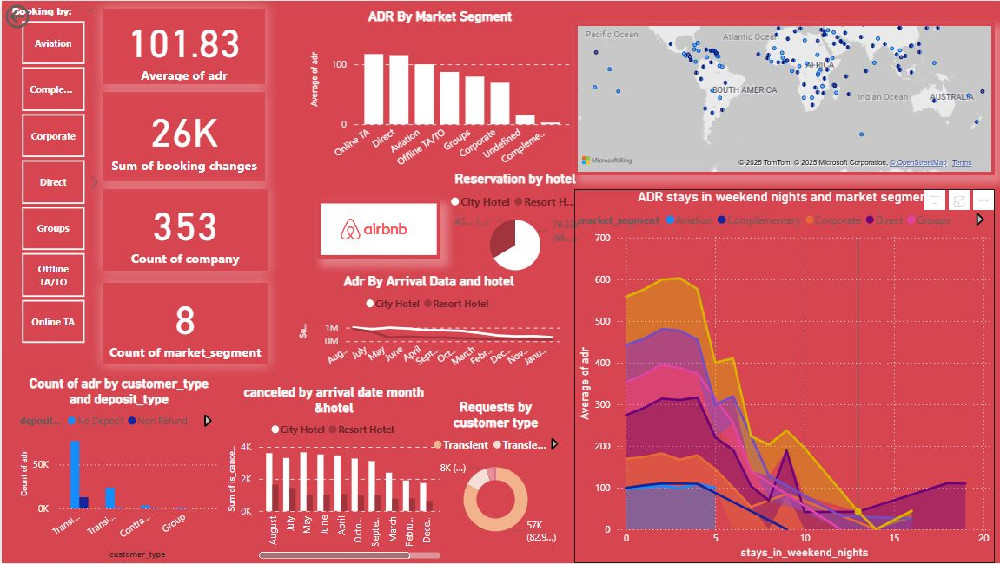
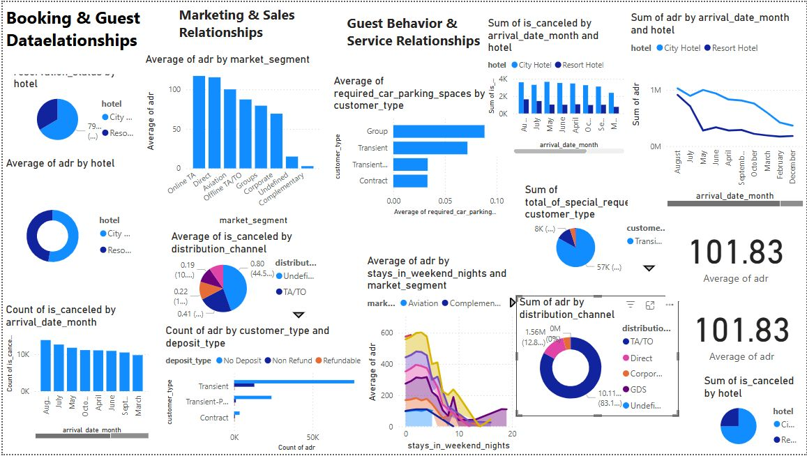

# 🏨 Hotel Booking Business Intelligence Analysis

## 📌 Project Overview
This project focuses on providing actionable insights into the hospitality industry using **Power BI**. By analyzing a complex hotel booking dataset, this dashboard visualizes key performance indicators (KPIs) such as cancellation rates, revenue trends, and customer behavior. 

The goal is to help hotel managers optimize their booking strategies, minimize cancellations, and maximize the **Average Daily Rate (ADR)**.

---

## 🖼️ Dashboard Preview
*To display your images, ensure they are uploaded to your repository with the names `dashboard1.png` and `dashboard2.png`.*

*Figure 1: Executive Summary - Revenue, ADR, and Total Bookings.*

*Figure 2: Customer Segmentation and Cancellation Patterns.*

---

## 📂 About the Dataset
The analysis is based on a dataset containing booking information for a **City Hotel** and a **Resort Hotel**. It includes 31 variables that describe the booking process and customer stay details.

### Key Data Columns:
* **Booking Status:** Whether the booking was Canceled, Checked-out, or a No-show.
* **Lead Time:** Number of days between the booking date and arrival date.
* **Arrival Date:** Year, Month, and Week number of arrival.
* **Stays:** Number of weekend nights and weeknights the guest stayed.
* **Guests:** Breakdown of Adults, Children, and Babies.
* **Meal:** Type of meal booked (Undefied/SC, BB, HB, FB).
* **Market Segment:** How the booking was made (Online TA, Offline TA/TO, Groups, Direct, etc.).
* **Financials:** ADR (Average Daily Rate), Required Car Parking Spaces, and Total Special Requests.

---

## 🛠️ Technical Workflow

### 1. Data Transformation (Power Query)
* **Data Cleaning:** Handled null values in the 'Children' and 'Country' columns.
* **Data Type Correction:** Ensured dates and financial figures were correctly formatted for calculation.
* **Conditional Columns:** Created custom categories for "Length of Stay" and "Guest Type."

### 2. Data Modeling
* Built a **Star Schema** to connect the primary booking table with lookup tables for countries and date hierarchies.
* Established one-to-many relationships to ensure slicers filter all visuals accurately.

### 3. DAX Measures (Analysis)
Created sophisticated measures to calculate:
* **Total Revenue** = `SUMX(Bookings, [ADR] * ([Stays In Week Nights] + [Stays In Weekend Nights]))`
* **Cancellation Rate** = `DIVIDE(COUNTROWS(FILTER(Bookings, [IsCanceled] = 1)), COUNTROWS(Bookings))`
* **Total Guests** = `SUM(Adults) + SUM(Children) + SUM(Babies)`

---

## 📊 Business Insights & Recommendations
* **High Cancellation Window:** Data shows that bookings with a lead time of over 100 days have a 40% higher chance of cancellation.
* **Seasonal Trends:** August and July are peak months for Resort Hotels, suggesting a need for dynamic pricing during these windows.
* **Market Segment Impact:** Online Travel Agents (TA) contribute the most volume, but Direct bookings provide the highest profit margin due to lower commission costs.

---

## 🚀 How to Run the Project
1.  Install **Power BI Desktop**.
2.  Clone this repository: `git clone https://github.com/YourUsername/Hotel-Booking-Analysis.git`
3.  Open the `booking hotel final .pbix` file.
4.  If the data path is broken, go to **Transform Data** > **Data Source Settings** and point it to the included dataset file.

---

## 👤 Author
**Your Name**
* [LinkedIn](https://www.linkedin.com/in/yourprofile)
* [Portfolio](https://yourportfolio.com)

---
*Thank you for visiting my project! If you find this helpful, feel free to ⭐ the repository.*
